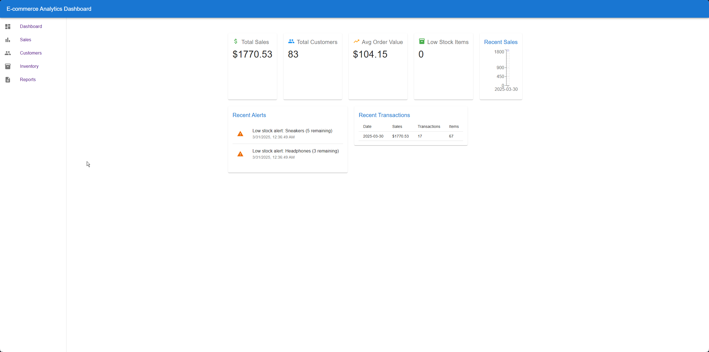
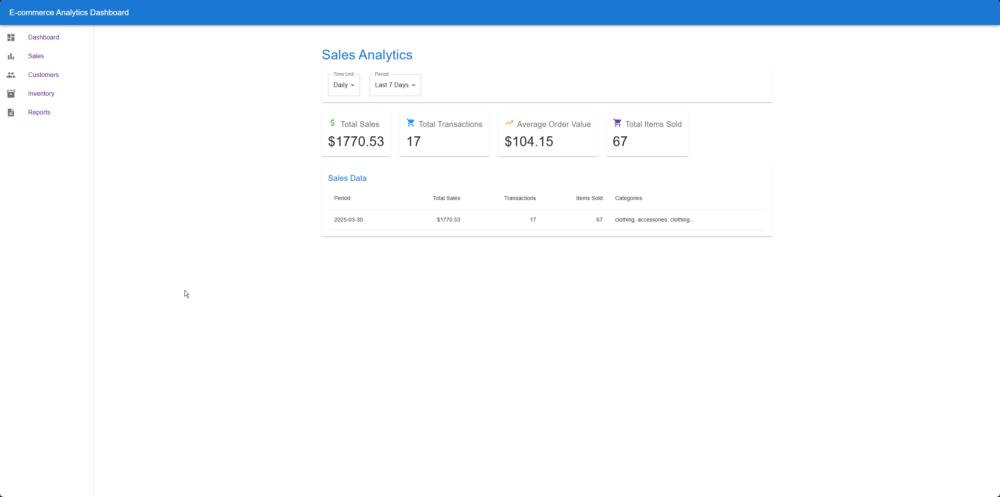
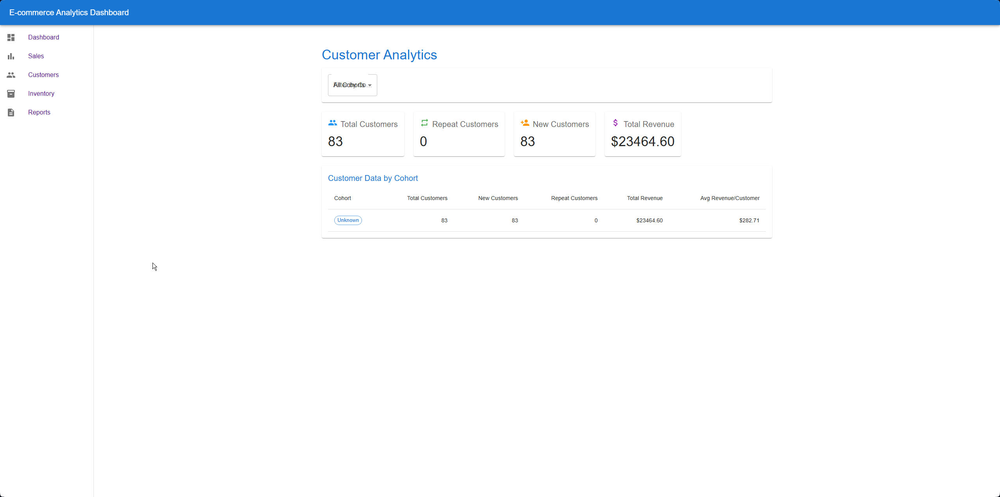
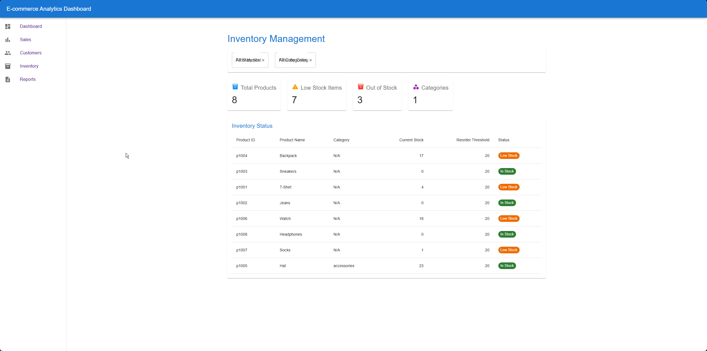
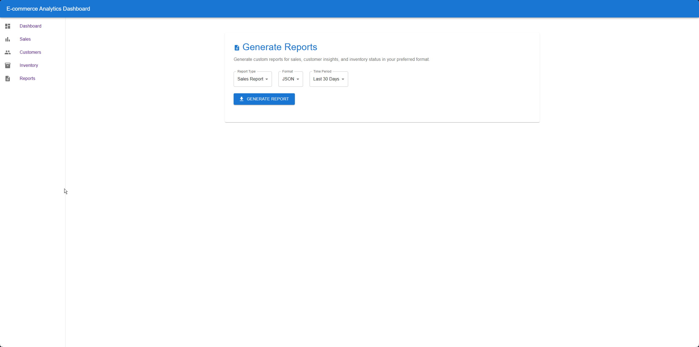

# Serverless E-commerce Analytics Pipeline

## Overview
This project demonstrates a comprehensive serverless architecture on AWS for e-commerce analytics. It showcases various AWS services working together to create a scalable, event-driven data pipeline that ingests, processes, analyzes, and visualizes e-commerce data without requiring actual platform connections.

## Live Demo
Experience the dashboard in action: [Dashboard](https://d2ljcyiwavv9qr.cloudfront.net)

## Architecture


### Key Components
- **Data Ingestion**: API Gateway, Lambda
- **Messaging**: SNS, SQS
- **Processing**: Lambda functions for orders, customers, and inventory
- **Storage**: DynamoDB for operational data, S3 for data lake
- **Integration**: EventBridge, AppFlow
- **Presentation**: API Gateway, CloudFront, React frontend

## AWS Services Used
- **AWS Lambda**: For serverless computation across the entire pipeline
- **Amazon API Gateway**: For RESTful APIs to ingest data and serve dashboard
- **Amazon SNS/SQS**: For decoupled messaging between components
- **Amazon DynamoDB**: For NoSQL database storage of processed analytics
- **Amazon S3**: For static website hosting and data lake storage
- **Amazon EventBridge**: For event-driven orchestration
- **AWS AppFlow**: For simulated integration with external systems
- **Amazon CloudFront**: For secure content delivery with Origin Access Identity

## Features
- Real-time transaction data processing
- Customer behavior analytics and cohort analysis
- Inventory tracking and low-stock alerting
- Business insights dashboard with visualizations
- Secure report generation with presigned URLs
- Scalable serverless architecture with no infrastructure management

## Technical Implementation
The project demonstrates these key serverless patterns:
- Event-driven architecture
- Pub/sub messaging
- Microservices decomposition
- Data lake implementation
- Infrastructure as Code (IaC) with Terraform
- CI/CD pipeline with GitHub Actions

## Skills Demonstrated
- **AWS Serverless Architecture**: Designed and implemented a complete serverless solution
- **Event-Driven Programming**: Built a system using SNS, SQS, and EventBridge for asynchronous processing
- **Infrastructure as Code**: Deployed the entire infrastructure using Terraform
- **CI/CD**: Automated deployment with GitHub Actions
- **Frontend Development**: Created a React dashboard with data visualizations
- **Security Best Practices**: Implemented CloudFront with Origin Access Identity
- **API Design**: Created RESTful APIs with CORS support and proper integration

## Infrastructure as Code

This project includes complete Infrastructure as Code (IaC) using Terraform, enabling the entire AWS architecture to be deployed programmatically. The Terraform configuration defines 75+ AWS resources across multiple services.

### Key Benefits of IaC Approach

- **Reproducibility**: The entire infrastructure can be recreated in any AWS account
- **Version Control**: Infrastructure changes are tracked alongside application code
- **Documentation**: The Terraform files serve as living documentation of the architecture
- **Consistency**: Eliminates configuration drift and environment differences
- **Automation**: Enables CI/CD pipeline integration for infrastructure updates

### Terraform Components

The Terraform configuration is organized into logical modules:
- Lambda functions and permissions
- API Gateway resources and methods
- EventBridge rules and targets
- DynamoDB tables
- S3 buckets and policies
- SNS/SQS messaging
- CloudFront distribution
- IAM roles and policies

For a detailed breakdown of all resources defined in the Terraform configuration, see the [Terraform Plan Summary](docs/terraform-plan-summary.md).

### Deployment with Terraform

To deploy the infrastructure using Terraform, see the [Deployment Guide](docs/deployment.md) for detailed instructions.

## Screenshots

### Dashboard Overview


### Sales Analytics


### Customer Data


### Inventory Information


### Report Generation


## Deployment Instructions
The project uses Infrastructure as Code with Terraform for deployment:

```bash
cd terraform
terraform init
terraform apply
```

Detailed deployment steps can be found in the [deployment guide](docs/deployment.md).

## Local Development
To run the frontend locally:

```bash
cd serverless-ecommerce-dashboard
npm install
npm start
```

Full development instructions can be found in the [development guide](docs/development.md).

## Project Structure
- **/src/lambda/**: Contains Lambda function code
- **/terraform/**: Contains Terraform IaC configuration
- **/serverless-ecommerce-dashboard/**: Contains React frontend
- **/docs/**: Contains documentation and diagrams

## Cost Analysis
This project is designed to run within the AWS Free Tier limits. Most services used (Lambda, API Gateway, SQS, SNS, DynamoDB) have generous free tier allowances. The estimated monthly cost outside of free tier would be approximately $20-30 with minimal usage.

See [cost analysis](docs/cost-analysis.md) for a detailed breakdown.

## Future Enhancements
- Add authentication with Amazon Cognito
- Implement real-time analytics with Kinesis
- Add machine learning for product recommendations
- Create mobile app using AWS Amplify

## License
This project is licensed under the MIT License - see the LICENSE file for details.