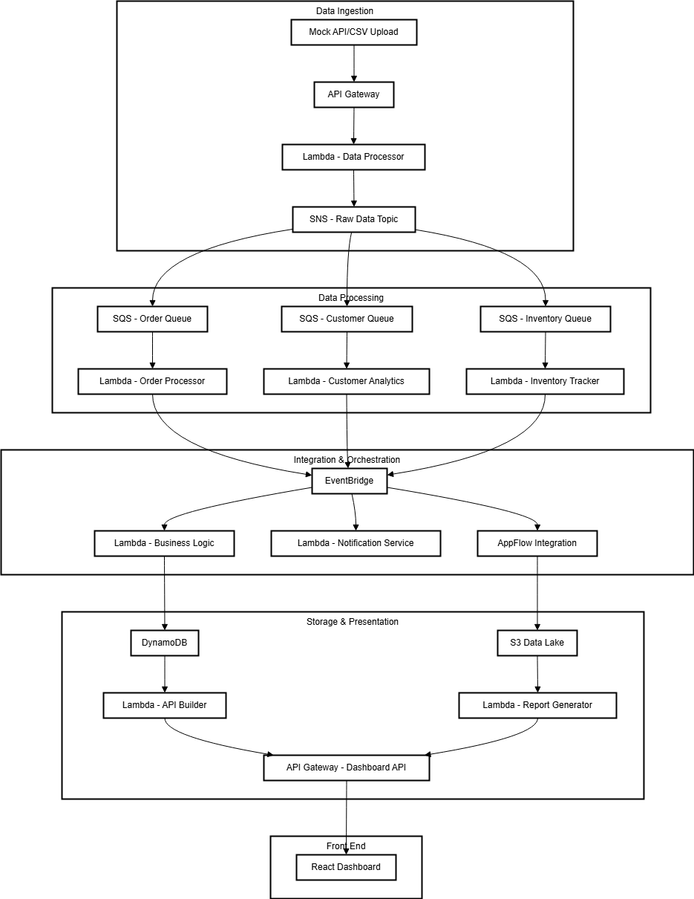

# Serverless E-commerce Analytics Pipeline

## Overview
This project demonstrates a serverless architecture for processing and analyzing e-commerce data using AWS services. It simulates a real-world scenario where transaction data is ingested, processed, analyzed, and visualized without requiring actual e-commerce platform connections.

## Architecture

The solution utilizes the following AWS services:
- **API Gateway**: Provides RESTful endpoints for data ingestion
- **Lambda**: Handles data processing and business logic
- **SNS/SQS**: Manages messaging between components
- **EventBridge**: Orchestrates event-driven workflows
- **DynamoDB**: Stores processed data
- **AppFlow**: Integrates with external systems (simulated)
- **S3**: Hosts data lake and static website content

## Features
- Real-time transaction data processing
- Customer behavior analytics
- Inventory tracking and alerting
- Business insights dashboard
- Scalable serverless architecture

## Technical Implementation
The project demonstrates these key serverless patterns:
- Event-driven architecture
- Pub/sub messaging
- Microservices decomposition
- Data lake implementation
- Infrastructure as Code (IaC)

## Deployment Instructions
Detailed deployment steps can be found in the [deployment guide](docs/deployment.md).

## Live Demo
A live demo of the dashboard is available at: [Demo Link]

## Local Development
Instructions for local development can be found in the [development guide](docs/development.md).

## Cost Analysis
This project is designed to run within the AWS Free Tier limits. See [cost analysis](docs/cost-analysis.md) for details.

## Future Enhancements
- ML-based recommendation engine
- A/B testing framework
- Real-time alerting system

## License
This project is licensed under the MIT License - see the LICENSE file for details.